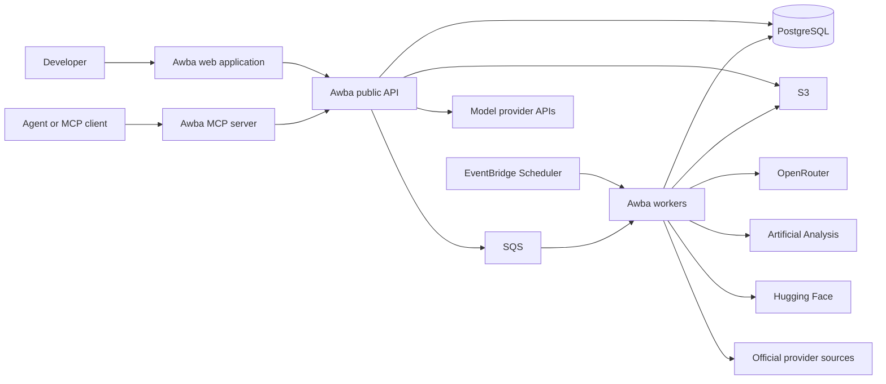
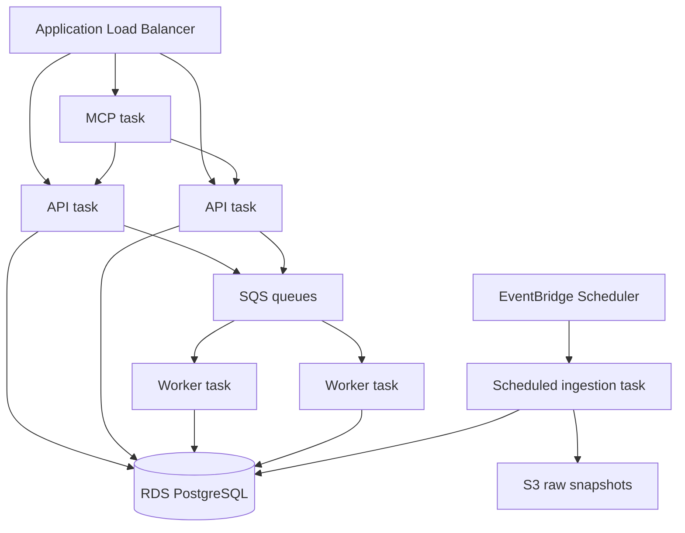
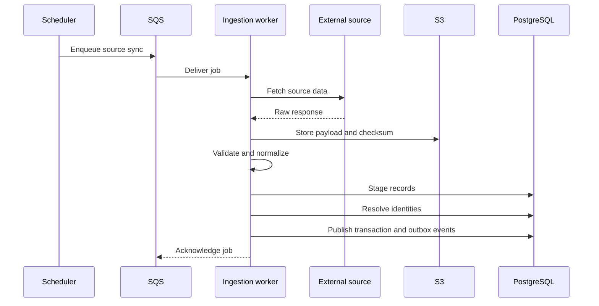
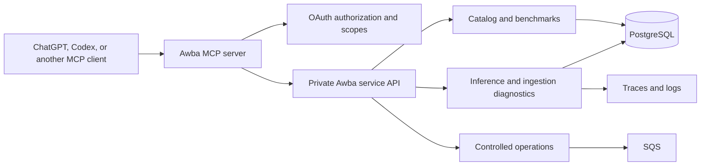
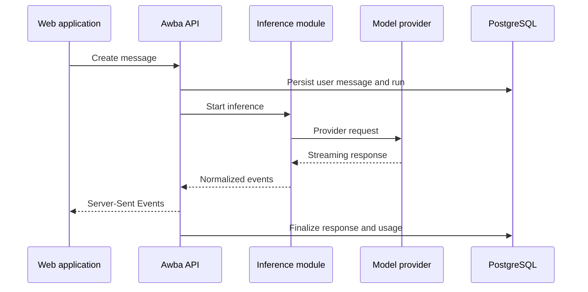
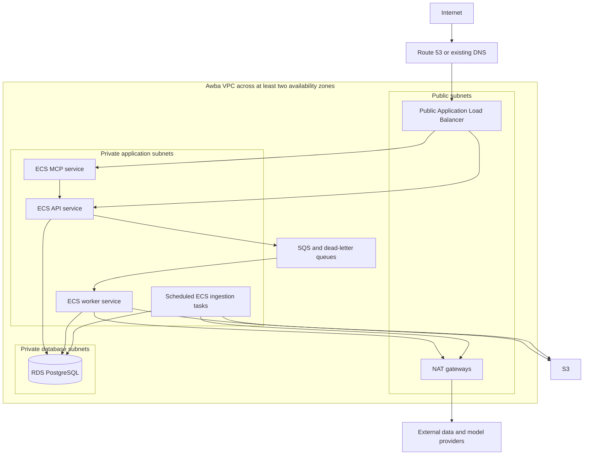

# Awba Backend Architecture

**Status:** Draft for implementation
**Last updated:** October 1, 2026
**Scope:** Production backend, data platform, public API, and the path from a modular monolith to microservices

Awba will begin as a developer-focused catalog for AI models, publishers, inference providers, pricing, benchmarks, and evaluation harnesses. The architecture must also support future modules such as chat, model inference, user workspaces, usage tracking, billing, and public developer APIs.

The recommended starting point is a Go modular monolith with a separate worker process, PostgreSQL, SQS, and container deployment on Amazon ECS with Fargate. The frontend communicates with one versioned public Awba API. Internal modules may become independently deployed services when scaling, security, reliability, or team ownership requires that separation.

## Architecture decisions

| Area | Decision | Reason |
| --- | --- | --- |
| Public API | Expose one API at `api.awba.dev` | Keeps authentication, errors, versioning, and service topology out of the frontend |
| Backend language | Go | Strong fit for long-running APIs, concurrent ingestion, streaming, small containers, and future service extraction |
| Initial architecture | Modular monolith plus separate workers | Preserves clear domain boundaries without premature distributed-system overhead |
| Frontend | React and TypeScript | Retains the existing application and generates a typed client from OpenAPI |
| Primary database | PostgreSQL | Supports transactional catalog updates, historical snapshots, search, and relational identities |
| Background processing | SQS and ECS workers | Separates asynchronous and retryable work from HTTP requests |
| Deployment | ECS with Fargate | Runs portable containers without operating an EC2 or Kubernetes cluster |
| API style | REST with OpenAPI; Server-Sent Events for chat streams | Provides a stable contract and a simple streaming mechanism |
| Agent interface | One remote MCP server at `mcp.awba.dev` | Gives agents controlled access to Awba data and diagnostics without exposing internal services |
| Infrastructure | Terraform or OpenTofu | Makes environments reproducible and reviewable |
| Service communication | Synchronous HTTP for queries; events for asynchronous effects | Makes latency and failure boundaries explicit |

## Architecture principles

1. **One public API, private internal services.** The web application should not know which internal component answers a request.
2. **Domain ownership is explicit.** Each module owns its business rules and persistence interfaces.
3. **External data is never fetched during a catalog read.** Workers ingest and validate source data before it is published.
4. **Prices and benchmark results are historical records.** New observations are appended rather than overwriting past values.
5. **Every displayed value has provenance.** Source, retrieval time, effective time, and methodology remain available.
6. **Asynchronous processing is idempotent.** Duplicate job delivery must not duplicate prices, usage, messages, or charges.
7. **Infrastructure is replaceable.** Application code depends on ports and interfaces rather than AWS SDK calls throughout the domain.
8. **Microservices are extracted for a demonstrated reason.** A larger feature list alone is not sufficient justification.

## System context



The public API is a backend for the Awba web application and future API consumers. It is also the stable routing boundary if internal modules become services. In this document, “gateway” refers to that application-level API boundary, not necessarily the managed AWS API Gateway product.

## Initial runtime architecture

The backend repository produces three container entry points from a shared Go codebase:

- `api` serves versioned HTTP endpoints and chat streams.
- `worker` consumes SQS jobs, dispatches outbox events, and performs background processing.
- `migrate` applies database migrations as a controlled deployment step.

The platform also runs an `mcp` service as a separate protocol adapter. The initial implementation should use TypeScript and the supported MCP SDK while the core domain and data services remain in Go. The MCP service contains tool definitions, authentication integration, result shaping, and safety annotations. It delegates business operations to private Awba APIs and does not connect directly to PostgreSQL.

Scheduled source ingestion runs as short-lived ECS tasks. Queue consumers may run continuously when asynchronous chat, usage, or notification work is introduced.



## Domain modules

### Catalog

The catalog module owns the canonical description of the AI market:

- Model publishers, such as OpenAI, Anthropic, Google, Meta, and Mistral
- Model families and immutable model versions
- Mutable aliases such as `latest`
- Input and output modalities
- Context and output limits
- Supported capabilities and API parameters
- Inference providers and serving endpoints
- Current pricing and historical pricing snapshots
- Availability, preview, deprecation, and retirement status
- External identifiers used by each source

A publisher and an inference provider are different entities. A model published by one company may be served by multiple providers at different prices and with different latency, regional availability, or feature support.

### Benchmarks

The benchmarks module owns evaluation definitions and results:

- Benchmark definitions and versions
- Evaluation harnesses and harness versions
- Task categories such as coding, reasoning, agentic work, and multimodal work
- Evaluation runs and configuration
- Model, provider, and agent-system results
- Scores, ranks, confidence information, and sample counts when available
- Source attribution and methodology links

A benchmark result is not automatically a property of a base model. Results from agent benchmarks such as SWE-bench can depend on the model, harness, tools, prompt, token budget, and execution environment. Awba must preserve those dimensions and avoid presenting incompatible results as direct comparisons.

### Ingestion

The ingestion module owns source adapters and publishing workflows:

- Source authentication and rate limits
- Fetching and archiving raw responses
- Schema validation
- Canonical identity resolution
- Unit and currency normalization
- Deduplication
- Transactional publication
- Review of unmatched or ambiguous models
- Ingestion status and freshness reporting

Each adapter converts a source-specific response into an internal ingestion contract. Source-specific fields remain in the raw snapshot and optional metadata, but they do not leak into the core domain model.

### Chat

The chat module will own user-facing conversation state:

- Conversations and messages
- Attachments and references
- System instructions and model configuration
- Chat run state
- Persisted responses and errors
- Sharing and retention policies

Chat stores the conversation. It does not own provider credentials or provider-specific request execution.

### Inference

The inference module will own model execution:

- Provider adapters
- Credential selection
- Model and provider routing
- Timeouts, retry policy, and circuit breaking
- Streaming responses
- Fallback policy
- Token and cost accounting
- Provider error normalization
- Safety and spending limits

The first implementation can live inside the API process. It should still expose an internal interface so it can later move to a dedicated service without changing the chat module or frontend contract.

### Identity and organizations

The identity module will own:

- Users and authentication identities
- Organizations and memberships
- Roles and permissions
- Sessions
- Awba API keys
- Security and audit events

User-owned data should include an organization identifier when multi-tenant use becomes part of the product. API keys must be stored as hashes, shown only at creation, scoped, and revocable.

### Usage and billing

The usage module will own:

- Input, output, cached, and reasoning token usage
- Provider cost and Awba charge
- Request-level usage attribution
- Budgets and spending limits
- Usage aggregation
- Credits, adjustments, and future billing events

Financially meaningful usage should use an append-only ledger. Corrections are represented by compensating entries rather than rewriting historical records.

## Source strategy

The initial catalog should combine multiple sources while preserving their individual provenance.

| Source | Initial use | Important constraint |
| --- | --- | --- |
| [OpenRouter model API](https://openrouter.ai/docs/quickstart) | Broad model inventory, routing identifiers, context, modalities, parameters, and pricing baseline | Aggregated routing prices may differ from direct-provider prices |
| [OpenRouter benchmark API](https://openrouter.ai/docs/api/api-reference/benchmarks/get-benchmarks) | Artificial Analysis and Design Arena benchmark feeds | Requires an API key and source-specific attribution |
| [Artificial Analysis API](https://artificialanalysis.ai/data-api/docs) | Independent intelligence, coding, agentic, price, latency, and throughput data | Access tier, rate limit, attribution, and redistribution terms must be verified |
| [Hugging Face leaderboard API](https://huggingface.co/docs/hub/leaderboard-data-guide) | Official benchmark leaderboards and open-model evaluations | Model identity and benchmark version must be matched explicitly |
| [LiveBench](https://github.com/LiveBench/LiveBench) | Category-level reasoning, coding, math, language, and instruction results | Preserve release and evaluation version |
| [SWE-bench](https://www.swebench.com/) | Coding-agent evaluation | Treat as an agent-system result unless the run isolates the model |
| Official publisher documentation | Release status, direct API price, limits, and canonical naming | Pages are inconsistent and may require reviewed adapters rather than generic scraping |

Awba should not silently blend source values. When sources disagree, the API should either return multiple observations or select one according to a documented precedence rule and retain the alternatives.

## Canonical identity model

Model identity is one of the highest-risk parts of the platform. The same model may appear under a dated identifier, an alias, a provider-specific route, or a marketing name.

The proposed identity hierarchy is:

```text
Publisher
  └── Model family
        └── Model version
              ├── External identifiers
              ├── Serving endpoints
              ├── Pricing snapshots
              └── Benchmark results
```

Identity matching uses explicit external identifier mappings first. Normalized-name matching may suggest a mapping, but ambiguous matches must enter a review queue rather than being published automatically.

Aliases are stored as time-aware mappings to exact versions. This prevents an alias such as `latest` from changing the meaning of historical usage or benchmark data.

## Database organization

The initial system uses one PostgreSQL cluster with schemas that reflect domain ownership.

| Schema | Important tables |
| --- | --- |
| `catalog` | `publishers`, `model_families`, `model_versions`, `external_identities`, `inference_providers`, `serving_endpoints`, `pricing_snapshots` |
| `benchmarks` | `definitions`, `harnesses`, `harness_versions`, `evaluation_runs`, `results` |
| `chat` | `conversations`, `messages`, `runs`, `attachments` |
| `identity` | `users`, `organizations`, `memberships`, `api_keys`, `audit_events` |
| `usage` | `request_usage`, `ledger_entries`, `budgets` |
| `platform` | `ingestion_runs`, `ingestion_items`, `outbox_events`, `job_locks` |

Foreign keys are required within a domain. Cross-domain references should use stable identifiers and be kept to a minimum so a domain can later move to its own database.

Prices must be stored as fixed-precision decimal values with their unit, currency, source, and effective timestamp. Floating-point values must not be used for billing calculations.

## Ingestion lifecycle



Every ingestion job has a stable idempotency key derived from the source, dataset version or retrieval window, and job type. Publication occurs in a database transaction. The transaction writes both domain changes and outbox events, preventing a successful database update from losing the event that announces it.

Invalid source records are quarantined with a reason. A partially invalid feed must not silently publish incomplete data as if it were complete. The last successful dataset remains available when an upstream source is unavailable.

## Public API contract

The public API is versioned from the first release:

```text
GET  /v1/catalog/models
GET  /v1/catalog/models/{modelVersionId}
GET  /v1/catalog/publishers
GET  /v1/catalog/inference-providers
GET  /v1/benchmarks
GET  /v1/benchmarks/harnesses
GET  /v1/compare/models
GET  /v1/platform/freshness

POST /v1/chat/conversations
GET  /v1/chat/conversations/{conversationId}
POST /v1/chat/conversations/{conversationId}/messages
GET  /v1/chat/runs/{runId}/events

GET  /v1/usage
GET  /v1/account/api-keys
POST /v1/account/api-keys
```

OpenAPI is the source of truth for request and response contracts. CI generates a TypeScript client for the React application and rejects incompatible contract changes.

API conventions:

- Cursor pagination for changing collections
- UTC timestamps in RFC 3339 format
- Stable opaque identifiers
- `application/problem+json` error responses
- Request correlation identifiers
- Idempotency keys for retryable writes
- ETags and cache headers for catalog reads
- Explicit freshness and provenance fields
- Deprecation headers before removing an API field or endpoint

## Agent and MCP integration

Awba exposes one remote Model Context Protocol server at `https://mcp.awba.dev/mcp`. It is an agent-facing entry point alongside the REST API, not a replacement for the REST API and not an independent source of business logic.



The production transport is Streamable HTTP. A local `stdio` adapter may be provided for repository development, but it must use the same tool contracts and authorization rules as the hosted service.

### MCP responsibility

The MCP server owns:

- Tool names, descriptions, schemas, and safety annotations
- OAuth integration and scope enforcement at every tool call
- Mapping MCP requests to private Awba API operations
- Sanitizing and limiting tool results for model consumption
- Stable structured output with canonical Awba identifiers
- Tool-call audit records, correlation identifiers, and rate limits
- Compatibility testing with supported MCP clients

It does not own model catalog records, benchmark calculations, chat history, inference routing, or operational state. Those remain within their corresponding backend domains.

### Tool groups

The initial MCP surface is divided by capability and authorization scope.

| Tool group | Example tools | Access |
| --- | --- | --- |
| Catalog | `search_models`, `get_model`, `compare_models`, `list_publishers`, `list_inference_providers` | Public read-only or `catalog:read` |
| Pricing and benchmarks | `get_model_pricing`, `get_benchmark_results`, `get_harness`, `get_data_freshness` | Public read-only or `catalog:read` |
| Developer diagnostics | `inspect_inference_run`, `explain_provider_error`, `check_model_availability`, `get_usage_summary` | Authenticated and tenant-scoped `diagnostics:read` or `usage:read` |
| Ingestion diagnostics | `get_ingestion_run`, `list_rejected_ingestion_items`, `get_source_freshness` | Operator `operations:read` |
| Controlled operations | `retry_failed_job`, `requeue_ingestion_run`, `disable_serving_endpoint` | Operator scope, explicit confirmation, audit log |

Tools should represent focused user goals. The server should not expose generic tools such as `execute_sql`, `run_shell`, `read_any_log`, `call_internal_url`, or `get_secret`. Broad administrative operations create excessive authority and are difficult for an agent to use safely.

### Diagnostic contract

Every Awba inference and ingestion operation receives a stable trace or run identifier. A developer can give that identifier to an agent, which can then use scoped MCP tools to retrieve:

- Current status and timestamps
- Selected model and inference provider
- Routing and retry attempts
- Normalized provider error categories
- Latency phases
- Token usage and calculated cost
- Relevant configuration flags
- Sanitized trace events
- Suggested next checks based on structured error metadata

Diagnostic tools do not return credentials. Prompt and response bodies are excluded by default and require a separate, explicit content-read scope if Awba chooses to support them. Tenant ownership is checked on every lookup, including when a valid identifier is supplied.

### Authentication and authorization

Anonymous access may be allowed only for deliberately public, read-only catalog tools. Customer-specific data, diagnostics, and operations require OAuth 2.1 authorization with narrowly defined scopes.

The MCP server acts as a resource server and validates token signature, issuer, audience, expiry, and scopes. It publishes protected-resource metadata and uses an established identity provider rather than implementing an authorization server from scratch.

Suggested scopes are:

```text
catalog:read
diagnostics:read
diagnostics:content:read
usage:read
operations:read
operations:write
```

Client-side tool allowlists improve agent behavior but are not an authorization boundary. The server enforces permissions independently for every tool call.

### Tool safety

- Read tools are marked read-only only when they cannot change state.
- Mutating or difficult-to-reverse tools use accurate destructive annotations.
- Operational writes require explicit user confirmation and an idempotency key.
- Tool outputs are bounded, paginated, and redacted before reaching the model.
- Tool results treat upstream text, logs, and prompts as untrusted data rather than instructions.
- Every authenticated call records the user, organization, scopes, tool, target resource, outcome, and correlation ID.
- Rate limits apply by organization, user, tool, and client connection.
- The MCP server has no database credentials and cannot bypass domain authorization.

OpenAI's MCP guidance states that servers publish tool definitions and execute calls, and that private data or actions must be authenticated and authorized by the server. Tool metadata and safety annotations are part of the product contract and must be tested like the REST API.

## Chat and streaming path

Awba should use Server-Sent Events for the initial chat stream. It matches the server-to-client token flow, works over ordinary HTTP, and is simpler to operate than a bidirectional WebSocket protocol.



Only provider-neutral events cross the inference boundary. Provider SDK response objects must not become part of the frontend contract. Retries, fallbacks, and duplicate-output prevention are inference concerns.

## AWS deployment topology

The proposed initial region is `ap-south-1` only if the first user base is primarily in India. The final region must be chosen using expected user location, provider latency, service availability, and data-residency needs.



### AWS resources

- ECS cluster using Fargate capacity providers
- ECS API service with at least two production tasks
- ECS MCP service with independent task scaling and a dedicated target group
- ECS worker service scaled by queue depth
- Short-lived ECS tasks for scheduled ingestion and database migration
- Application Load Balancer with an ACM certificate
- RDS PostgreSQL with encryption, automated backups, and production Multi-AZ configuration
- SQS standard queues with dead-letter queues
- EventBridge Scheduler for recurring ingestion
- S3 with versioning and lifecycle rules for source snapshots
- ECR for container images
- Secrets Manager for provider and database credentials
- CloudWatch Logs, metrics, dashboards, and alarms
- AWS Budgets and cost anomaly alerts
- KMS keys where customer-managed encryption is required
- WAF when public traffic and abuse patterns justify it

The web application can remain on Vercel. It calls only `api.awba.dev`. CORS is restricted to known Awba origins, and authenticated requests use secure cookies or scoped bearer tokens according to the selected identity design.

## Security model

### Network security

- Only the load balancer is publicly reachable.
- ECS tasks run in private application subnets.
- RDS runs in isolated database subnets and accepts connections only from approved ECS security groups.
- Internal services use private discovery and are not assigned public endpoints.
- Outbound access is controlled and monitored.

### Identity and secrets

- Workloads use task-specific IAM roles with least privilege.
- GitHub Actions authenticates to AWS using OIDC and short-lived roles.
- No AWS access keys or provider secrets are committed to Git.
- Secrets are stored in Secrets Manager and rotated where supported.
- Administrative operations require stronger authorization and audit logging.
- Provider credentials never reach the browser.
- The MCP service receives only a private Awba service credential and never receives database credentials.
- OAuth scopes and tenant ownership are enforced again by the core service even after the MCP layer validates the token.

### Application security

- Validate all external and client input at the transport boundary.
- Apply organization-level authorization inside the domain service, not only in HTTP middleware.
- Rate-limit public, authenticated, and administrative traffic separately.
- Protect state-changing requests against replay with idempotency keys where appropriate.
- Record security-relevant events without logging credentials or private prompt contents.
- Scan dependencies, containers, and infrastructure changes in CI.

Chat introduces additional privacy obligations. Before launch, Awba must define prompt retention, provider data-use policies, deletion behavior, regional processing, and whether customers can bring their own provider keys.

## Reliability and failure handling

The following are proposed initial production objectives and should be confirmed before launch:

| Objective | Initial target |
| --- | --- |
| Public API availability | 99.9 percent monthly |
| Public MCP availability | 99.9 percent monthly after public launch |
| Catalog data freshness | Daily successful ingestion; alert after 24 hours without success |
| Maximum catalog staleness | Continue serving the last verified dataset and visibly report its age |
| Recovery point objective | 15 minutes for primary application data |
| Recovery time objective | 2 hours for the initial production system |

Reliability controls include:

- Timeouts on every network and database operation
- Bounded retries with exponential backoff and jitter
- Circuit breakers for failing external providers
- SQS visibility timeouts sized to job execution time
- Dead-letter queues with alarms
- Idempotent workers and ingestion transactions
- Graceful API shutdown and connection draining
- Database point-in-time recovery and restore testing
- Health endpoints that distinguish process health from dependency readiness
- Load shedding and spending limits for inference operations

## Observability

All services emit structured JSON logs with the environment, service, version, request ID, trace ID, organization ID when permitted, and error classification.

OpenTelemetry provides traces across HTTP requests, database calls, queues, workers, and model-provider requests. Metrics should cover:

- Request rate, latency, and error rate by endpoint
- Active chat streams
- MCP initialization latency, tool-call rate, authorization failures, and tool errors
- Database pool saturation and query latency
- SQS age, depth, retries, and dead-letter count
- Ingestion duration, record counts, rejected records, and source freshness
- Provider latency, errors, token usage, and spend
- Deployment health and task restarts

Alerts should be actionable. Initial alerts include elevated API errors, unavailable healthy tasks, database resource pressure, dead-letter messages, stale catalog data, ingestion failures, and unexpected inference spend.

## Testing strategy

The delivery pipeline should contain:

- Unit tests for domain rules and normalization
- Fixture-based contract tests for every external source adapter
- Database integration tests against PostgreSQL
- Migration tests from the last production schema
- HTTP contract tests generated from OpenAPI examples
- MCP tool schema, authorization, redaction, and annotation tests
- Worker idempotency and retry tests
- End-to-end browser tests with Playwright
- Load tests for catalog queries, MCP tool calls, and chat streaming
- Restore exercises for database backups and S3 snapshots

External APIs should be represented by recorded, sanitized fixtures in deterministic CI tests. A smaller scheduled test can verify that live source schemas have not drifted.

## Continuous delivery

The proposed GitHub Actions deployment flow is:

1. Format, lint, test, and scan the repository.
2. Build the versioned Go binaries and MCP service.
3. Build minimal container images and push them to ECR with the commit SHA and release tag.
4. Produce and review the Terraform plan.
5. Run forward-compatible migrations as a one-time ECS task.
6. Deploy the ECS service using a rolling or canary strategy.
7. Wait for health and smoke-test checks.
8. Roll back the application if health checks fail.

Database changes use the expand-and-contract pattern. A release must not require the old application version and old schema to disappear simultaneously.

## Environment strategy

| Environment | Purpose | Suggested shape |
| --- | --- | --- |
| Local | Development and tests | Docker Compose with PostgreSQL, a local queue substitute or LocalStack, API, worker, and web application |
| Staging | Integration and release validation | Small AWS deployment with representative networking and managed services |
| Production | User traffic | Multi-AZ networking, at least two API tasks, production database backups, alarms, and restricted access |

Production and non-production should eventually use separate AWS accounts under AWS Organizations. Infrastructure state, secrets, databases, and IAM roles must not be shared between production and staging.

## Repository evolution

The current repository can evolve toward this layout without requiring immediate service separation:

```text
awba/
├── apps/
│   ├── web/                 # React and TypeScript frontend
│   └── mcp/
│       ├── src/tools/       # MCP tool definitions and handlers
│       ├── src/auth/        # OAuth resource-server integration
│       └── tests/           # Contract, scope, and redaction tests
├── backend/
│   ├── cmd/
│   │   ├── api/
│   │   ├── worker/
│   │   └── migrate/
│   ├── internal/
│   │   ├── catalog/
│   │   ├── benchmarks/
│   │   ├── ingestion/
│   │   ├── chat/
│   │   ├── inference/
│   │   ├── identity/
│   │   ├── usage/
│   │   └── platform/
│   ├── migrations/
│   └── openapi/
├── infra/
│   ├── modules/
│   └── environments/
├── docs/
└── docker-compose.yml
```

The existing frontend does not need to move before backend work begins. Repository restructuring should happen as a separate, reviewable change.

## Path to microservices

Microservice extraction is justified when a domain needs independent scaling, releases, ownership, security isolation, technology, or availability. Extraction should not be based only on source-code size.

The likely order is:

1. **Ingestion worker:** already a separate runtime process because scheduled and retryable work differs from HTTP traffic.
2. **Inference service:** extracted when streaming load, provider isolation, regional routing, or independent scaling requires it.
3. **Chat service:** extracted when conversation traffic or product ownership becomes independent.
4. **Usage and billing service:** extracted when financial correctness and audit requirements require stronger isolation.
5. **Catalog and benchmark services:** extracted only if ingestion volume, public API traffic, or team ownership makes it useful.

When extraction happens:

- The public API remains the only browser-facing backend.
- The gateway routes to private services and aggregates responses.
- A service owns its database and no other service writes to it.
- Cross-service effects use events where immediate consistency is unnecessary.
- Synchronous calls have strict deadlines and do not form deep dependency chains.
- Existing OpenAPI behavior remains backward compatible.

Kubernetes, Kafka, and a service mesh are not initial requirements. They should be introduced only when ECS, SQS, and the operational model no longer meet measured needs.

## Cost controls

AWS has a non-zero production baseline. RDS, the load balancer, NAT gateways, logs, and multi-availability-zone resources may cost more than the initial Go containers.

Cost controls include:

- AWS Budgets and cost anomaly detection before deployment
- Small staging resources with scheduled shutdown where practical
- ARM64 Fargate tasks when dependencies support them
- Short-lived scheduled ingestion tasks rather than idle workers
- Log retention limits and S3 lifecycle policies
- Queue-driven worker scaling
- Cost attribution tags on every resource
- Inference budgets at the organization and provider level

A pricing estimate must be prepared for the chosen region and availability target before infrastructure is provisioned.

## Implementation phases

### Phase 1 Catalog foundation

- Create the Go backend workspace and module boundaries.
- Define PostgreSQL migrations for catalog, benchmarks, and platform schemas.
- Implement OpenRouter ingestion using archived source fixtures.
- Add canonical model identity mapping and review status.
- Publish read-only model, publisher, provider, pricing, and freshness endpoints.
- Generate the frontend client from OpenAPI.
- Connect the current React application to the Awba API.
- Publish the initial read-only MCP catalog tools against the same application API.

### Phase 2 Production platform

- Create Terraform modules and staging infrastructure.
- Add ECS API, scheduled workers, RDS, SQS, S3, ECR, and observability.
- Add CI/CD, migrations, smoke tests, backups, and restore validation.
- Configure `api.awba.dev`, TLS, CORS, rate limiting, budgets, and alarms.
- Deploy production after staging acceptance.

### Phase 3 Benchmarks and comparisons

- Add Artificial Analysis and Hugging Face adapters.
- Model benchmark definitions, harnesses, configurations, and runs.
- Add model comparison and price-history endpoints.
- Add provenance and methodology displays to the frontend.

### Phase 4 Accounts and chat

- Add identity, organizations, sessions, and API keys.
- Add conversations, messages, attachments, and retention controls.
- Add the inference abstraction and initial provider adapters.
- Add Server-Sent Event streaming, usage accounting, and spending limits.
- Add tenant-scoped MCP inference and usage diagnostic tools.

### Phase 5 Independent services

- Review measured load and team boundaries.
- Extract inference, chat, or billing only where the extraction criteria are met.
- Preserve the public API contract throughout the migration.

## Open decisions

The following decisions must be resolved before their corresponding implementation phase:

- Primary AWS region and disaster-recovery region
- Expected initial availability target and infrastructure budget
- Authentication provider or in-house identity implementation
- Whether chat uses Awba-managed provider keys, customer-provided keys, or both
- Prompt, message, attachment, and raw-source retention periods
- Benchmark and pricing redistribution requirements for every source
- Initial publisher and inference-provider coverage
- Public API monetization and rate limits
- Multi-tenant isolation requirements
- Whether public MCP catalog tools allow anonymous access or require an Awba account
- MCP OAuth identity provider and final scope definitions
- Whether prompt and response content is ever available through diagnostic tools
- Whether staging and production begin in separate AWS accounts

## References

- [Amazon ECS capacity and launch type guidance](https://docs.aws.amazon.com/AmazonECS/latest/developerguide/capacity-launch-type-comparison.html)
- [Amazon ECS service autoscaling](https://docs.aws.amazon.com/AmazonECS/latest/developerguide/service-auto-scaling.html)
- [AWS Fargate pricing](https://aws.amazon.com/fargate/pricing/)
- [Scheduling ECS tasks with EventBridge Scheduler](https://docs.aws.amazon.com/AmazonECS/latest/developerguide/tasks-scheduled-eventbridge-scheduler.html)
- [OpenRouter model API](https://openrouter.ai/docs/quickstart)
- [OpenRouter benchmark API](https://openrouter.ai/docs/api/api-reference/benchmarks/get-benchmarks)
- [Artificial Analysis data API](https://artificialanalysis.ai/data-api/docs)
- [Hugging Face leaderboard data access](https://huggingface.co/docs/hub/leaderboard-data-guide)
- [LiveBench repository](https://github.com/LiveBench/LiveBench)
- [SWE-bench](https://www.swebench.com/)
- [OpenAI MCP connections](https://developers.openai.com/api/docs/guides/agents-api/tools/mcp)
- [OpenAI guidance for building an MCP server](https://developers.openai.com/plugins/build/mcp-server)
- [OpenAI MCP authentication guidance](https://developers.openai.com/plugins/build/auth)
